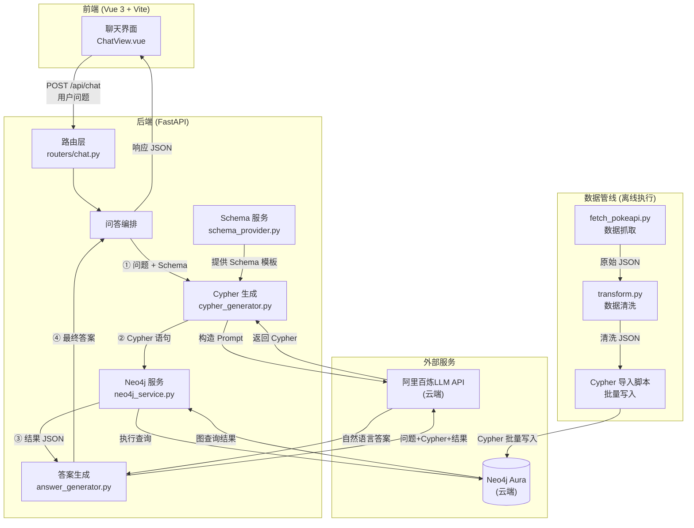
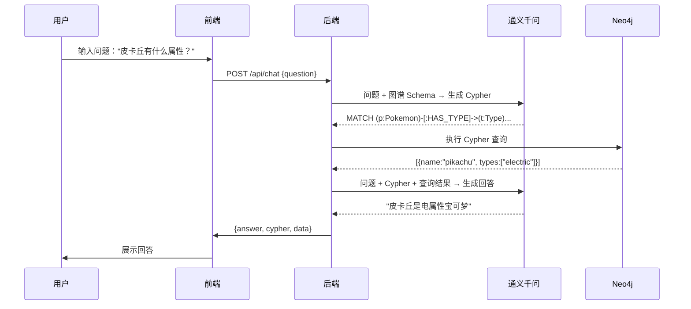
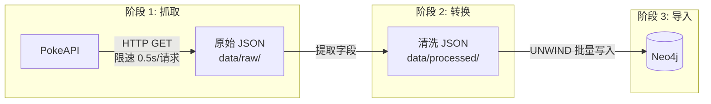

# 宝可梦知识图谱 — 架构设计方案（改进版）

## 1. 项目概述

**项目名称**：基于知识图谱的宝可梦智能问答系统

**项目目标**：构建一个基于 Neo4j 图数据库的宝可梦知识图谱，结合通义千问大语言模型实现自然语言问答。

**核心技术栈**：

| 层次 | 技术选型 |
|------|---------|
| 前端 | Vue 3 + Vite + Axios |
| 后端 | Python FastAPI |
| 图数据库 | Neo4j Aura (云端) |
| LLM | 通义千问 API (云端，OpenAI 兼容格式) |
| 数据源 | PokeAPI (REST) |
| 本体 | Protege (Pokebase.ttl) |

**团队分工建议（3 人）(参考)**：

| 角色 | 职责 |
|------|------|
| 成员 A（后端 + 数据） | FastAPI 开发、数据导入脚本、Neo4j 操作 |
| 成员 B（前端） | Vue 3 聊天界面开发、API 对接 |
| 成员 C（LLM + 本体） | Prompt 工程、Cypher 生成优化、本体映射 |


**团队分工**：

| 角色 | 职责 |
|------|------|
|  |  |
|  | |
| | |

---

## 2. 目录结构

```
pokemon-kg/
├── README.md
├── .gitignore
├── .env.example                    # 环境变量模板
│
├── backend/                        # 后端服务
│   ├── main.py                     # FastAPI 入口，注册路由
│   ├── config.py                   # 配置（从环境变量读取）
│   ├── requirements.txt            # Python 依赖
│   ├── check_env.py                # 环境检查脚本
│   │
│   ├── routers/                    # API 路由
│   │   ├── chat.py                 # /api/chat 问答接口
│   │   ├── query.py                # /api/query 直接 Cypher 查询
│   │   └── import_data.py          # /api/import 数据导入接口
│   │
│   ├── services/                   # 业务逻辑
│   │   ├── llm_service.py          # 调用通义千问 API
│   │   ├── neo4j_service.py        # Neo4j 连接与 Cypher 执行
│   │   ├── cypher_generator.py     # LLM 生成 Cypher 查询
│   │   ├── answer_generator.py     # LLM 根据查询结果生成回答
│   │   └── schema_provider.py      # 提供图谱 Schema 信息给 LLM
│   │
│   ├── models/                     # Pydantic 数据模型
│   │   ├── chat_request.py         # 请求体定义
│   │   ├── chat_response.py        # 响应体定义
│   │   └── pokemon.py              # 宝可梦相关数据结构
│   │
│   └── data/                       # 导入数据
│       ├── raw/                    # 从 PokeAPI 抓取的原始 JSON
│       ├── processed/              # 清洗后的 JSON
│       └── cypher/                 # Cypher 导入脚本
│           ├── init_constraints.cypher
│           ├── import_types.cypher
│           ├── import_pokemon.cypher
│           ├── import_abilities.cypher
│           ├── import_moves.cypher
│           └── import_relationships.cypher
│
├── data_pipeline/                  # 数据采集与处理
│   ├── fetch_pokeapi.py            # 从 PokeAPI 抓取数据（带重试和限速）
│   ├── transform.py                # JSON 转换，匹配本体 Schema
│   └── run_pipeline.py             # 一键执行采集→转换→导入
│
├── frontend/                       # 前端项目
│   ├── index.html
│   ├── package.json
│   ├── vite.config.js
│   ├── src/
│   │   ├── main.js                 # Vue 入口
│   │   ├── App.vue                 # 根组件
│   │   ├── api/
│   │   │   └── index.js            # Axios 封装
│   │   ├── views/
│   │   │   └── ChatView.vue        # 聊天主页面
│   │   └── components/
│   │       ├── ChatBubble.vue      # 聊天气泡组件
│   │       └── ChatInput.vue       # 输入框组件
│   └── public/
│
├── ontology/                       # 本体文件
│   └── Pokebase.ttl                # Protege 导出的本体
│
├── docs/                           # 文档
│   ├── 概要设计.md
│   └── 架构设计.md
│
└── tests/                          # 测试用例
    └── test_cases.md               # 典型问答测试集
```

---

## 3. 系统架构图



### 核心问答流程（4 步）



---

## 4. 模块详细设计

### 4.1 前端模块

| 模块 | 文件 | 输入 | 输出 | 功能说明 |
|------|------|------|------|---------|
| 聊天主页面 | `views/ChatView.vue` | 用户输入文本 | 渲染对话列表 | 管理对话状态（本地 state），调用 API，渲染问答气泡，处理 loading 和错误提示 |
| 聊天气泡 | `components/ChatBubble.vue` | 消息对象 `{role, content}` | 渲染 DOM | 区分用户/系统消息样式，支持 Markdown 渲染 |
| 输入框 | `components/ChatInput.vue` | 用户键盘输入 | emit 提交事件 | 输入框 + 发送按钮，Enter 快捷发送，发送后禁用防止重复提交 |
| API 封装 | `api/index.js` | question 字符串 | Axios Promise | 封装 POST `/api/chat`，统一处理 loading 状态和错误提示 |

### 4.2 后端模块

| 模块 | 文件 | 输入 | 输出 | 功能说明 |
|------|------|------|------|---------|
| 路由层 | `routers/chat.py` | HTTP 请求 `ChatRequest` | HTTP 响应 `ChatResponse` | 接收问题，调用问答服务，返回结果 |
| Cypher 生成 | `services/cypher_generator.py` | 用户问题 + Schema 模板 | Cypher 查询语句 | 构造 Prompt 发给 LLM，解析返回的 Cypher，语法校验 |
| 答案生成 | `services/answer_generator.py` | 用户问题 + Cypher + 查询结果 | 自然语言回答 | 构造 Prompt 发给 LLM，生成用户友好的回答 |
| Neo4j 服务 | `services/neo4j_service.py` | Cypher 语句 + 参数 | 查询结果 (JSON) | 管理 Neo4j 驱动连接池，执行 Cypher，返回结果，异常处理 |
| LLM 服务 | `services/llm_service.py` | messages 列表 | LLM 响应文本 | 封装通义千问 API 调用（云端 HTTP 请求，无需本地模型），重试机制 |
| Schema 服务 | `services/schema_provider.py` | 无 (读取常量) | Schema 描述文本 | 将本体 Schema 转化为 LLM 可理解的文本描述 |
| 数据导入路由 | `routers/import_data.py` | 导入请求 | 导入进度/结果 | 触发数据导入流程（开发调试用） |

### 4.3 数据管线模块

| 模块 | 文件 | 输入 | 输出 | 功能说明 |
|------|------|------|------|---------|
| 数据抓取 | `data_pipeline/fetch_pokeapi.py` | PokeAPI URL | 原始 JSON 文件 | 按需抓取 pokemon/type/ability/move 数据，带限速（0.5s/请求）、重试（3 次）、断点续传 |
| 数据转换 | `data_pipeline/transform.py` | 原始 JSON | 清洗后 JSON | 提取本体所需字段，生成符合 Neo4j 导入格式的数据 |
| 管线入口 | `data_pipeline/run_pipeline.py` | 无 (脚本执行) | 控制台日志 | 一键执行：抓取→转换→导入 Neo4j |

### 4.4 Pydantic 数据模型

`models/` 目录存放请求/响应的数据结构定义，用于 FastAPI 参数校验和自动 API 文档生成：

```python
# models/chat_request.py
from pydantic import BaseModel

class ChatRequest(BaseModel):
    question: str

# models/chat_response.py
class ChatResponse(BaseModel):
    answer: str              # 自然语言回答
    cypher: str              # 生成的 Cypher 查询（透明展示给用户）
    data: list[dict]         # Neo4j 查询原始结果

# models/query_request.py
class QueryRequest(BaseModel):
    cypher: str
    parameters: dict = {}
```

### 4.5 Neo4j Schema 映射（本体→图数据库）

本体 `Pokebase.ttl` 到 Neo4j 的映射规则：

| TTL 本体定义 | Neo4j 实现 | 说明 |
|-------------|-----------|------|
| `:Pokemon` (Class) | 节点标签 `:Pokemon` | id, name, height, weight, base_experience |
| `:Type` (Class) | 节点标签 `:Type` | id, name |
| `:Ability` (Class) | 节点标签 `:Ability` | id, name |
| `:Move` (Class) | 节点标签 `:Move` | id, name, power, accuracy, pp, priority |
| `:PhysicalMove/SpecialMove/StatusMove` | Move 节点属性 `damage_class` | 子类映射为属性值 |
| `:HAS_TYPE` | 关系 `[:HAS_TYPE]` | Pokemon→Type, Move→Type |
| `:HAS_ABILITY` | 关系 `[:HAS_ABILITY]` | Pokemon→Ability |
| `:CAN_LEARN` | 关系 `[:CAN_LEARN]` | Pokemon→Move |
| `:EVOLVES_TO / :EVOLVES_FROM` | 当前数据库未导入 | 进化关系不属于当前可查询 Schema |
| `:DOUBLE_DAMAGE_TO/FROM` | `[:DAMAGE_TO {multiplier: 2.0}]` | 6 种克制关系统一为 1 种 |
| `:HALF_DAMAGE_TO/FROM` | `[:DAMAGE_TO {multiplier: 0.5}]` | 用 multiplier 属性区分倍率 |
| `:NO_DAMAGE_TO/FROM` | `[:DAMAGE_TO {multiplier: 0.0}]` | 0.0 表示无效 |

---

## 5. REST API 设计

| 方法 | 路径 | 请求体 | 响应体 | 说明 |
|------|------|--------|--------|------|
| POST | `/api/chat` | `{"question": "皮卡丘有什么属性？"}` | `{"answer": "...", "cypher": "...", "data": [...]}` | 主问答接口 |
| POST | `/api/query` | `{"cypher": "MATCH ...", "params": {}}` | `{"data": [...]}` | 直接 Cypher 查询（调试用） |
| POST | `/api/import` | `{"entities": ["pokemon"], "limit": 151}` | `{"status": "ok", "count": 151}` | 数据导入（开发用） |
| GET  | `/api/schema` | 无 | `{"nodes": [...], "relationships": [...]}` | 获取图谱 Schema |
| GET  | `/api/health` | 无 | `{"neo4j": "ok", "llm": "ok"}` | 健康检查 |

---

## 6. 数据导入管线

### 6.1 数据源（PokeAPI）

| 实体 | API 端点 | 说明 |
|------|---------|------|
| Pokemon | `GET /api/v2/pokemon/{id}` | types, abilities, moves, height, weight |
| Type | `GET /api/v2/type/{id}` | damage_relations（克制关系） |
| Ability | `GET /api/v2/ability/{id}` | name |
| Move | `GET /api/v2/move/{id}` | power, accuracy, pp, priority, type, damage_class |

### 6.2 三阶段导入流程



**阶段 1 — 抓取** (`fetch_pokeapi.py`)：
- 遍历 1~N 的 Pokemon ID，调用 PokeAPI 保存原始 JSON
- 批量获取 Type(18 个)、Ability、Move 数据
- **限速**：0.5s/请求，避免被 PokeAPI 限流
- **重试**：失败请求重试 3 次（指数退避）
- **断点续传**：已抓取的跳过，支持中断后继续

**阶段 2 — 转换** (`transform.py`)：
- 提取本体所需字段，输出到 `data/processed/`
- 输出文件：`pokemon_nodes.json`、`type_nodes.json`、`ability_nodes.json`、`move_nodes.json`
- 关系文件：`has_type_relations.json`、`has_ability_relations.json`、`can_learn_relations.json`

**阶段 3 — 导入** (Cypher 脚本)：
```cypher
-- 约束
CREATE CONSTRAINT pokemon_id IF NOT EXISTS
FOR (p:Pokemon) REQUIRE p.id IS UNIQUE;

-- 节点导入
UNWIND $batch AS row
MERGE (p:Pokemon {id: row.id})
SET p.name = row.name, p.height = row.height, p.weight = row.weight, p.base_experience = row.base_experience

-- 关系导入
UNWIND $batch AS row
MATCH (p:Pokemon {id: row.pokemon_id})
MATCH (t:Type {name: row.type_name})
MERGE (p)-[r:HAS_TYPE]->(t)
SET r.slot = row.slot
```

### 6.3 建议数据量

| 阶段 | 范围 | Pokemon | 说明 |
|------|------|---------|------|
| MVP 验证 | 初代 | 151 只 | 快速验证流程 |
| 正式版 | 前 3 代 | 386 只 | 课程展示够用 |
| 完整版 | 全部 | 1000+ | 时间充裕时扩展 |

---

## 7. LLM 集成设计

### 7.1 通义千问 API 调用

使用 `openai` Python SDK（通义千问兼容 OpenAI 接口格式），调用方式为**云端 HTTP 请求**，不需要本地部署模型：

```python
from openai import OpenAI
import os

client = OpenAI(
    api_key=os.getenv("DASHSCOPE_API_KEY"),
    base_url="https://dashscope.aliyuncs.com/compatible-mode/v1"
)

response = client.chat.completions.create(
    model="qwen-plus",
    messages=[{"role": "user", "content": prompt}],
    temperature=0.1  # 降低随机性，提高 Cypher 生成稳定性
)
```

### 7.2 Cypher 生成 Prompt（带 Few-Shot 示例）

```
你是一个宝可梦知识图谱的 Cypher 查询专家。根据用户的问题，生成对应的 Cypher 查询语句。

## 图谱 Schema
节点类型和属性：
- Pokemon {id, name, height, weight, base_experience}
- Type {id, name}
- Ability {id, name}
- Move {id, name, power, accuracy, pp, priority}

关系类型：
- (Pokemon)-[:HAS_TYPE]->(Type)
- (Pokemon)-[:HAS_ABILITY]->(Ability)
- (Pokemon)-[:CAN_LEARN]->(Move)
- (Type)-[:DAMAGE_TO {multiplier}]->(Type)
- (Move)-[:HAS_TYPE]->(Type)

注意：name 属性是英文小写（如 "pikachu", "fire"）
当前数据库没有 EVOLVES_TO / EVOLVES_FROM 进化关系。

## 示例
用户问："皮卡丘有什么属性？"
返回：MATCH (p:Pokemon {name: "pikachu"})-[:HAS_TYPE]->(t:Type) RETURN t.name

用户问："火属性克制哪些属性？"
返回：MATCH (fire:Type {name: "fire"})-[:DAMAGE_TO {multiplier: 2.0}]->(weak:Type) RETURN weak.name

用户问："哪些属性克制水？"
返回：MATCH (t:Type {name: "water"})<-[:DAMAGE_TO {multiplier: 2.0}]-(weak:Type) RETURN weak.name

## 用户问题
{question}

请只返回 Cypher 查询语句，不要包含其他内容。
```

### 7.3 答案生成 Prompt

```
你是一个宝可梦知识图谱问答助手。根据用户的提问和图数据库查询结果，生成自然语言回答。

## 用户提问
{question}
## 执行的 Cypher 查询
{cypher}
## 查询结果
{results_json}

请用简洁友好的中文回答用户的问题。如果查询结果为空，请告知用户未找到相关信息。
```

### 7.4 关键配置

```python
# config.py
import os
from dotenv import load_dotenv

load_dotenv()  # 从.env 加载环境变量

# Neo4j Aura 云数据库
neo4j_uri = os.getenv("NEO4J_URI", "neo4j+s://98695523.databases.neo4j.io")
neo4j_user = os.getenv("NEO4J_USER", "98695523")
neo4j_password = os.getenv("NEO4J_PASSWORD")

dashscope_api_key = os.getenv("DASHSCOPE_API_KEY")
dashscope_base_url = "https://dashscope.aliyuncs.com/compatible-mode/v1"
llm_model = os.getenv("LLM_MODEL", "qwen-plus")
```

```
# .env.example
NEO4J_URI=neo4j+s://98695523.databases.neo4j.io
NEO4J_USER=98695523
NEO4J_PASSWORD=your_password_here
DASHSCOPE_API_KEY=sk-your_api_key_here
LLM_MODEL=qwen-plus
```

---

## 8. 环境检查脚本

创建 `backend/check_env.py`，启动前检查环境：

```python
#!/usr/bin/env python
"""检查运行环境是否就绪"""
import sys
import os
from pathlib import Path

def check_env():
    errors = []
    
    # 1. 检查.env 文件
    if not Path(".env").exists():
        errors.append("缺少.env 文件，请从.env.example 复制并配置")
    
    # 2. 检查环境变量
    if not os.getenv("NEO4J_PASSWORD"):
        errors.append("NEO4J_PASSWORD 未设置")
    if not os.getenv("DASHSCOPE_API_KEY"):
        errors.append("DASHSCOPE_API_KEY 未设置")
    
    # 3. 检查 Neo4j 连接
    try:
        from neo4j import GraphDatabase
        driver = GraphDatabase.driver(
            os.getenv("NEO4J_URI", "neo4j+s://98695523.databases.neo4j.io"),
            auth=(os.getenv("NEO4J_USER", "98695523"), os.getenv("NEO4J_PASSWORD"))
        )
        driver.verify_connectivity()
        driver.close()
        print("✓ Neo4j 连接成功")
    except Exception as e:
        errors.append(f"Neo4j 连接失败：{e}")
    
    # 4. 检查依赖
    try:
        import openai
        print("✓ openai 库已安装")
    except ImportError:
        errors.append("openai 库未安装，请运行 pip install -r requirements.txt")
    
    if errors:
        print("\n错误：")
        for err in errors:
            print(f"  ✗ {err}")
        sys.exit(1)
    else:
        print("\n✓ 所有检查通过，环境就绪！")

if __name__ == "__main__":
    check_env()
```

使用方式：
```bash
cd backend
python check_env.py
```

---

## 9. 测试用例

创建 `tests/test_cases.md`，包含典型问答测试集：

### 9.1 实体查询类

| 编号 | 问题 | 预期 Cypher | 预期答案 |
|------|------|------------|---------|
| T1 | "皮卡丘是什么属性？" | `MATCH (p:Pokemon {name: "pikachu"})-[:HAS_TYPE]->(t:Type) RETURN t.name` | "皮卡丘是电属性宝可梦" |
| T2 | "小火龙有什么特性？" | `MATCH (p:Pokemon {name: "charmander"})-[:HAS_ABILITY]->(a:Ability) RETURN a.name` | 列出特性名称 |
| T3 | "喷火龙的体重是多少？" | `MATCH (p:Pokemon {name: "charizard"}) RETURN p.weight` | "喷火龙的体重是 90.5kg" |

### 9.2 属性克制类

| 编号 | 问题 | 预期 Cypher | 预期答案 |
|------|------|------------|---------|
| T4 | "火属性克制哪些属性？" | `MATCH (f:Type {name: "fire"})-[:DAMAGE_TO {multiplier: 2.0}]->(t:Type) RETURN t.name` | "火属性克制草、冰、虫、钢" |
| T5 | "哪些属性克制水？" | `MATCH (t:Type {name: "water"})<-[:DAMAGE_TO {multiplier: 2.0}]-(weak:Type) RETURN weak.name` | "电属性和草属性克制水" |

### 9.3 当前 Schema 限制类

| 编号 | 问题 | 预期 Cypher | 预期答案 |
|------|------|------------|---------|
| T6 | "妙蛙种子如何进化？" | `RETURN "当前数据库 Schema 没有进化关系数据，无法查询进化链。" AS message` | 说明当前数据库没有进化关系数据 |

### 9.4 验证方式

```bash
# 手动测试：调用/api/query 执行预期 Cypher，验证结果正确
# 端到端测试：调用/api/chat 输入问题，验证回答符合预期
```

---

## 10. 开发计划与团队分工

### 10.1 四周开发阶段

| 周次 | 阶段 | 交付物 | 负责人 |
|------|------|--------|--------|
| 第 1 周 | 环境搭建 + 数据管线 | Neo4j 运行、数据导入成功、图谱可查 | A + C |
| 第 2 周 | 后端核心 + LLM 集成 | FastAPI 问答接口可用、Cypher 生成正确 | A + C |
| 第 3 周 | 前端开发 + 联调 | 聊天界面完成、端到端问答跑通 | B + A |
| 第 4 周 | 优化 + 文档 + 展示 | Prompt 优化、异常处理、演示准备 | 全员 |

### 10.2 任务拆分（参考）

**成员 A — 后端 + 数据**
- `neo4j_service.py`：Neo4j 连接池、Cypher 执行、结果格式化
- `data_pipeline/fetch_pokeapi.py`：PokeAPI 数据抓取（含限速和缓存）
- `data_pipeline/transform.py`：数据清洗转换
- Cypher 导入脚本编写
- FastAPI 路由和数据模型
- `check_env.py` 环境检查脚本

**成员 B — 前端**
- Vue 3 项目初始化（Vite）
- `ChatView.vue`：对话列表、滚动、loading 状态、错误提示
- `ChatBubble.vue`：区分用户/机器人消息
- `ChatInput.vue`：输入框、发送按钮、防重复提交
- `api/index.js`：Axios 封装
- 前后端联调

**成员 C — LLM + 本体**
- `llm_service.py`：通义千问 API 封装
- `cypher_generator.py`：Prompt 设计（含 few-shot 示例）与 Cypher 解析
- `answer_generator.py`：答案生成 Prompt
- `schema_provider.py`：Schema 信息结构化
- 本体映射验证（TTL → Neo4j Schema 一致性）
- Prompt 调优和边界测试
- `tests/test_cases.md` 测试用例编写

### 10.3 里程碑检查点

| 检查点 | 验证方式 | 通过标准 |
|--------|---------|---------|
| M1: 数据导入完成 | Neo4j Browser 查询 `MATCH (n) RETURN count(n)` | 节点数 > 0，关系数 > 0 |
| M2: LLM 生成 Cypher | 调用 `/api/query` 手写 Cypher 能返回结果 | 10 条常见问题 Cypher 正确 |
| M3: 端到端问答 | `POST /api/chat {"question":"皮卡丘是什么属性"}` | 返回正确中文回答 |
| M4: 前端可用 | 浏览器打开聊天界面，输入问题得到回答 | UI 完整，交互流畅 |
| M5: 测试通过 | 执行 `tests/test_cases.md` 中 10 个用例 | 至少 8 个用例通过 |

---


---

## 12. 技术依赖清单

**Python (requirements.txt)**：
```
fastapi==0.115.*
uvicorn==0.34.*
neo4j==5.*
openai>=1.0.*
httpx==0.28.*
pydantic==2.*
python-dotenv==1.0.*
```

**前端 (package.json)**：
```json
{
  "dependencies": {
    "vue": "^3.5.*",
    "axios": "^1.7.*"
  },
  "devDependencies": {
    "@vitejs/plugin-vue": "^5.*",
    "vite": "^6.*"
  }
}
```

**本地服务**：
- 通义千问 API Key — https://dashscope.console.aliyun.com/
- Neo4j Aura 云数据库 — 已配置

**Python 依赖**：
```bash
pip install -r requirements.txt
```

**Node.js 依赖**：
```bash
cd frontend && npm install
```

---

## 13. 启动方式

```bash
# 0. 配置环境变量
cp .env.example .env
# 编辑.env 文件，填入 NEO4J_PASSWORD 和 DASHSCOPE_API_KEY

# 1. 检查环境
cd backend
python check_env.py

# 2. 数据导入
cd ../data_pipeline
python run_pipeline.py

# 3. 启动后端
cd ../backend
pip install -r requirements.txt
uvicorn main:app --reload --port 8000

# 4. 启动前端
cd ../frontend
npm install
npm run dev

# 5. 打开浏览器访问 http://localhost:5173
```

---

## 附录 A：.gitignore

```
# Python
__pycache__/
*.py[cod]
*$py.class
*.so
.env
.venv/
venv/

# 数据文件（敏感数据）
data/raw/*.json
data/processed/*.json

# 前端
node_modules/
dist/
*.local

# IDE
.idea/
.vscode/
*.swp

# 日志
*.log

# 临时文件
*.tmp
```

---

## 附录 B：环境检查清单

启动项目前确认：

- [ ] `.env` 文件已创建并配置 `NEO4J_URI`、`NEO4J_USER`、`NEO4J_PASSWORD`、`DASHSCOPE_API_KEY`
- [ ] Python 依赖已安装：`pip install -r requirements.txt`
- [ ] 前端依赖已安装：`npm install`
- [ ] 环境检查通过：`python check_env.py`
- [ ] 数据已导入：Neo4j Browser 查询有节点和关系
- [ ] Neo4j Aura 云数据库可连接（https://console.neo4j.io/）

