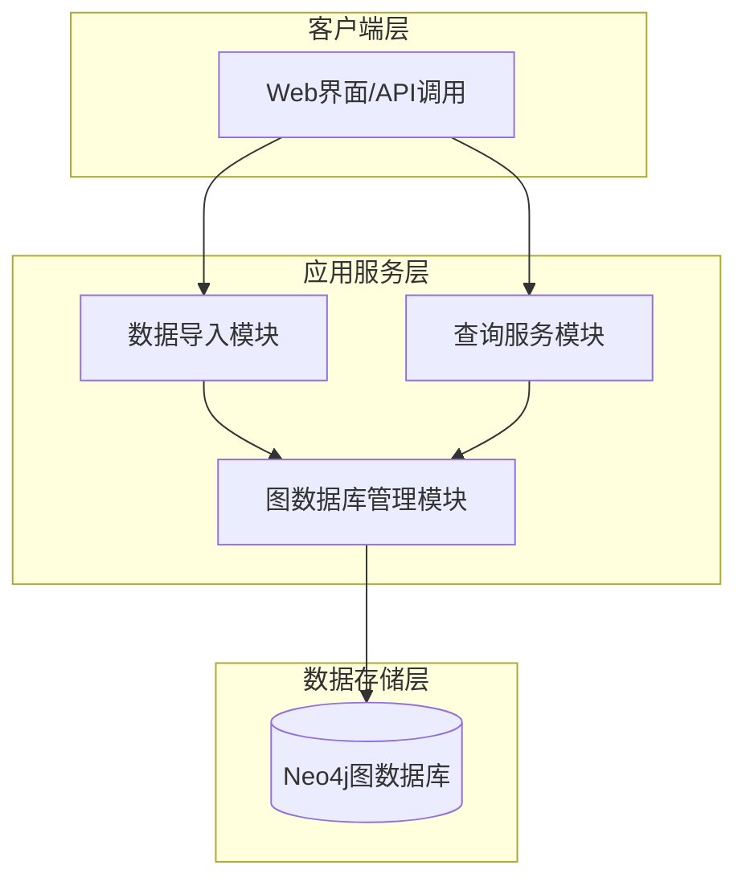
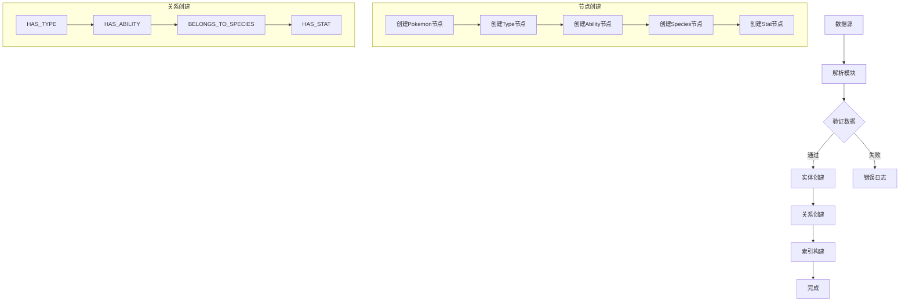
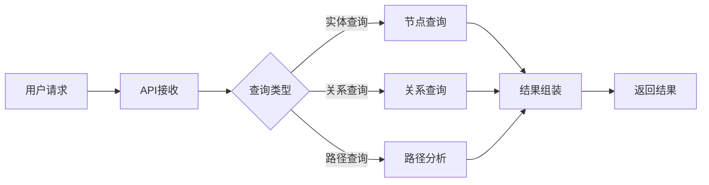
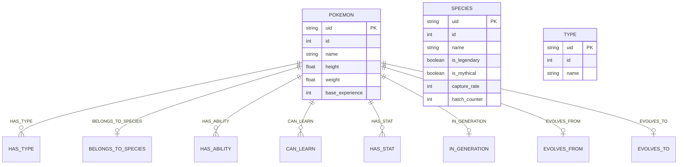

# 宝可梦知识图谱概要设计

## 1. 选题

**项目名称**：宝可梦（Pokemon）知识图谱构建

**选题背景**：宝可梦是一个包含丰富实体和关系的大型 IP 体系，包含Pokemon、Species、Type、Ability、Move、Generation、EvolutionChain、EvolutionEvent、Item、Stat 等多种实体类型，以及它们之间的复杂关系。

**项目目标**：构建一个结构化的宝可梦知识图谱，实现实体管理和关系查询。

---

## 2. 系统架构



---

## 3. 模块流程

### 3.1 数据导入流程



### 3.2 查询流程



---

## 4. 数据结构

### 4.1 节点（实体）

| 节点类型 | 属性 | 说明 |
|---------|------|------|
| Pokemon | uid, id, name, height, weight, base_experience | 宝可梦实例 |
| Species | uid, id, name, is_legendary, is_mythical, capture_rate, hatch_counter | 物种信息 |
| Type | uid, id, name | 属性类型 |
| Ability | uid, id, name | 特性 |
| Move | uid, id, name, power, accuracy, pp, type, damage_class | 招式 |
| Generation | uid, id, name | 世代 |
| EvolutionChain | uid, id | 进化链 |
| EvolutionEvent | uid, id, trigger | 进化事件 |
| Item | uid, id, name | 道具 |
| Stat | uid, id, name | 属性值 |

### 4.2 边（关系）

| 关系类型 | 起始节点 | 目标节点 | 边属性 |
|---------|---------|---------|--------|
| BELONGS_TO_SPECIES | Pokemon | Species | - |
| HAS_TYPE | Pokemon | Type | slot |
| HAS_ABILITY | Pokemon | Ability | slot, is_hidden |
| CAN_LEARN | Pokemon | Move | learn_method, level_learned_at |
| HAS_STAT | Pokemon | Stat | base_stat, effort |
| IN_GENERATION | Pokemon | Generation | - |
| IN_EVOLUTION_CHAIN | Pokemon | EvolutionChain | - |
| EVOLVES_FROM | Pokemon | Pokemon | - |
| CAN_EVOLVE_VIA | Pokemon | EvolutionEvent | - |
| EVOLVES_TO | Pokemon | Pokemon | - |
| TRIGGERED_BY | EvolutionEvent | Species | - |
| USES_ITEM | Pokemon | Item | - |

### 4.3 数据模型示例



---

## 5. 接口设计

### 5.1 数据导入接口

```cypher
// 创建Pokemon节点
MERGE (p:Pokemon {uid: $uid})
SET p.id = $id,
    p.name = $name,
    p.height = $height,
    p.weight = $weight,
    p.base_experience = $base_experience

// 创建Type节点与关系
MATCH (p:Pokemon {uid: $pokemon_uid})
MERGE (t:Type {uid: $type_uid})
SET t.id = $type_id,
    t.name = $type_name
MERGE (p)-[r:HAS_TYPE]->(t)
SET r.slot = $slot

// 创建Ability节点与关系
MATCH (p:Pokemon {uid: $pokemon_uid})
MERGE (a:Ability {uid: $ability_uid})
SET a.id = $ability_id,
    a.name = $ability_name
MERGE (p)-[r:HAS_ABILITY]->(a)
SET r.slot = $slot,
    r.is_hidden = $is_hidden

// 创建Species关系
MATCH (p:Pokemon {uid: $pokemon_uid})
MERGE (s:Species {uid: $species_uid})
SET s.id = $species_id,
    s.name = $species_name
MERGE (p)-[:BELONGS_TO_SPECIES]->(s)

// 创建Stat关系
MATCH (p:Pokemon {uid: $pokemon_uid})
MERGE (s:Stat {uid: $stat_uid})
SET s.id = $stat_id,
    s.name = $stat_name
MERGE (p)-[r:HAS_STAT]->(s)
SET r.base_stat = $base_stat,
    r.effort = $effort
```

### 5.2 查询接口

| 接口名称 | 功能 | Cypher示例 |
|---------|------|-----------|
| getPokemonById | 根据ID查询宝可梦 | `MATCH (p:Pokemon {id: $id}) RETURN p` |
| getPokemonTypes | 查询宝可梦的属性 | `MATCH (p:Pokemon)-[r:HAS_TYPE]->(t:Type) WHERE p.id = $id RETURN t` |
| getPokemonAbilities | 查询宝可梦的特性 | `MATCH (p:Pokemon)-[r:HAS_ABILITY]->(a:Ability) WHERE p.id = $id RETURN a, r.is_hidden` |
| getEvolutionChain | 查询进化链 | `MATCH (p:Pokemon)-[:EVOLVES_FROM]->(prev) WHERE p.id = $id RETURN prev` |
| getPokemonStats | 查询宝可梦属性值 | `MATCH (p:Pokemon)-[r:HAS_STAT]->(s:Stat) WHERE p.id = $id RETURN s, r.base_stat` |
| searchByType | 按属性搜索 | `MATCH (p:Pokemon)-[:HAS_TYPE]->(t:Type {name: $type}) RETURN p` |
| searchByGeneration | 按世代搜索 | `MATCH (p:Pokemon)-[:IN_GENERATION]->(g:Generation {name: $gen}) RETURN p` |
| searchLegendary | 搜索传说宝可梦 | `MATCH (p:Pokemon)-[:BELONGS_TO_SPECIES]->(s:Species) WHERE s.is_legendary = true RETURN p` |

---

## 6. 技术选型

| 层次 | 技术 |
|-----|------|
| 图数据库 | Neo4j |
| 后端API | Python (FastAPI/Flask) |
| 前端 | 可选 (Vue/React) |
| 数据格式 | JSON |

---

## 7. 待解决问题

- 进化链数据需手动输入（API暂未支持）
- 部分关系数据需要补充完善